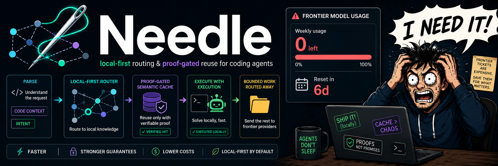
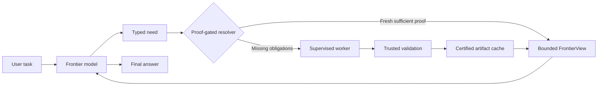

<picture>
  
</picture>

# Needle

Needle is a local-first task router and proof-gated semantic cache for coding
agents. It moves bounded repository work away from an expensive frontier model,
validates the resulting evidence, and reuses that evidence only while it remains
fresh and sufficient.

> [!WARNING]
> **Pre-alpha developer preview.** Needle is an active source project for
> inspection, experimentation, and contribution. It is not a supported
> production tool, and its interfaces, storage, configuration, and behavior may
> change without compatibility guarantees.

[Project status](PROJECT_STATUS.md) · [Roadmap](docs/ROADMAP.md) · [Documentation](docs/README.md) ·
[Contributing](CONTRIBUTING.md) · [Security policy](SECURITY.md) · [Benchmark evidence](benchmarks/README.md)

## Why Needle exists

Frontier coding models are capable, but repository discovery can consume a
large portion of their context and cost. Needle treats that work as a bounded
request that can be routed to a smaller supervised worker. When the same
validated knowledge is useful again, a proof-gated cache can avoid the worker
as well.

The product has two economic layers:

1. **Routing:** delegate suitable discovery to a lower-cost worker.
2. **Reuse:** avoid that worker when certified evidence already satisfies the
   request.

Needle is not a coding client, code graph, search engine, language server, or
replacement for the main model. Those systems can provide discovery tools;
Needle owns routing, validation, reuse, and bounded continuation.

## Request flow



The main model can declare a need through the development-only unversioned
`@@need` lifecycle protocol or call the structured `need_context` MCP tool. Both
transports compile to the same semantic domain model. Before returning cached
context, Needle checks exact subject identity, semantic world, dependency
freshness, contradictions, residual intent, and obligation coverage.

## Capability snapshot

### Available in the source

- Typed routes for implementation location, state-flow tracing, and focused
  tests.
- Validator-derived artifacts, dependency manifests, validation certificates,
  and replayable sufficiency proofs.
- Exact, coverage, composite, partial, and narrowly bounded claim-level reuse.
- A read-only evidence worker supervised through Codex App Server.
- Disposable source checkouts, trusted-test approval, bounded repair, cleanup,
  and process-tree cancellation.
- Sequential and steer-delivered multi-need coordination.
- A structured stdio MCP server with `need_context`, `prepare_change`, and
  `verify_change`.
- A resident runtime, SQLite persistence, IPC, and an embedded React control
  plane.
- Isolated change preparation, independent verification, one bounded repair,
  and explicit parent-owned apply.

### Experimental or incompletely validated

- Claim authority is currently narrow and provider-backed claim reuse has not
  been validated.
- Verified changes have deterministic offline coverage but no provider-backed
  patcher or verifier observation.
- Windows has live calibration evidence; Linux and macOS currently have code
  and CI support only.
- The web control plane is an operational development interface, not a stable
  end-user product.

### Not ready

- Stable installation or configuration compatibility.
- A public beta or supported deployment.
- Cross-platform live validation.
- A powered multi-task benchmark and statistically supported savings claim.
- Automatic commits, pushes, merges, or releases.

See [Project status](PROJECT_STATUS.md) for current maturity, evidence levels,
capabilities, and milestones.

## Evidence and benchmarks

Needle publishes reproducible reports for the observations used to evaluate
routing and reuse. Each report records the task, source snapshot, models,
pricing basis, observed result, and limitations.

| Evidence | Observed result | Boundary |
|---|---|---|
| [Routing and cache calibration](benchmarks/results/live/routing-and-cache-calibration.md) | One `locate.implementation` sample used one miss worker and a zero-worker `CoverageHit`; observed routing, cache, and end-to-end reductions were 74.41%, 57.24%, and 89.06% | Single pinned task; not statistical |
| [Structured MCP cache hit](benchmarks/results/live/structured-mcp-cache-hit.md) | One authoritative three-artifact `CompositeHit`, zero worker, zero main discovery, final answer present | Functional live calibration; no counterfactual |
| [Partial and cross-route reuse](benchmarks/results/live/partial-and-cross-route-reuse.md) | One worker computed only `FocusedTests`; the following `tests.relevant` request reused it with zero worker | Functional live calibration; no powered savings claim |
| [Claim reuse performance](benchmarks/results/offline/claim-reuse-performance.md) | Warm `ClaimHit` p95 remained below 5.36 ms on the recorded Windows host | Offline host-specific measurement |

Earlier routing and cache observations remain useful as calibration of an
earlier product boundary. They do not establish claims about the current proof
kernel. See [Benchmarking](docs/BENCHMARKING.md) for the comparison contract
and [the evidence index](benchmarks/README.md) for accepted reports.

## Safety model

- Evidence workers are read-only.
- Patch workers may write only inside a disposable checkout and only within
  paths declared by the parent.
- The active worktree is never a worker's writable root.
- Workers receive no network, credentials, project instructions, hooks,
  plugins, external MCP servers, or multi-agent capability.
- Test execution is optional, trusted-repository only, policy-bound, and
  confined to disposable locations.
- Unknown validity becomes `BYPASS`; stale or contradicted evidence is never
  served.
- Applying a verified patch is a separate, explicit, parent-owned operation.

Read [Security and approvals](docs/SECURITY_AND_APPROVALS.md) before changing a
worker, command, or apply boundary.

## Build from source

This is a source-development workflow, not an installation guide. A clean
clone must build the frontend before compiling the Rust binary because the
binary embeds `crates/needle-app/web/dist`.

Requirements:

- Rust `1.90.0` with `rustfmt` and `clippy`;
- Codex `0.144.0` for the currently validated adapter;
- Node.js `22.22.0` or newer and npm for building the embedded frontend assets
  (Node is not needed at runtime).

```text
cd crates/needle-app/web
npm ci
npm run build
cd ../../..
cargo build --locked --workspace
cargo test --locked --workspace
```

The packages intentionally remain `publish = false`. Do not depend on the CLI,
database schema, MCP schema, or configuration as a stable interface.

Continue with [Developer setup](docs/DEVELOPER_SETUP.md) for profile
initialization and serving, and see
[Development and troubleshooting](docs/DEVELOPMENT_AND_TROUBLESHOOTING.md).

## Workspace

Needle is organized as a five-crate Rust workspace:

| Crate | Responsibility |
|---|---|
| `needle-core` | Semantic protocol, domain objects, contracts, and bounded plans |
| `needle-runtime` | Persistence, resolution, orchestration, sandboxing, and approvals |
| `needle-platform-codex` | Codex hooks, App Server client, worker transport, and compatibility |
| `needle-bench` | Evidence fixtures, accounting, gates, and performance measurements |
| `needle-app` | CLI, resident runtime, MCP server, web control plane, and experiments |

## Documentation

- [Project status and milestones](PROJECT_STATUS.md)
- [Product roadmap](docs/ROADMAP.md)
- [Documentation index](docs/README.md)
- [Architecture](docs/ARCHITECTURE.md)
- [Artifacts and cache](docs/ARTIFACTS_AND_CACHE.md)
- [MCP transport](docs/MCP_TRANSPORT.md)
- [Verified changes](docs/VERIFIED_CHANGES.md)
- [Runtime and web control plane](docs/RUNTIME_AND_WEB_CONTROL_PLANE.md)
- [Benchmarking](docs/BENCHMARKING.md)
- [Security policy](SECURITY.md)
- [Contributing](CONTRIBUTING.md)
- [Code provenance](CODE_PROVENANCE.md)

## Contributing

AI may assist analysis, code, tests, and documentation. A human contributor must
read and understand the complete change, verify every claim, finalize the commit
and pull-request text, and personally perform commit, push, and pull-request
publication. See [CONTRIBUTING.md](CONTRIBUTING.md) for the complete policy.

## License

Needle is available under the [Apache License 2.0](LICENSE.md).
